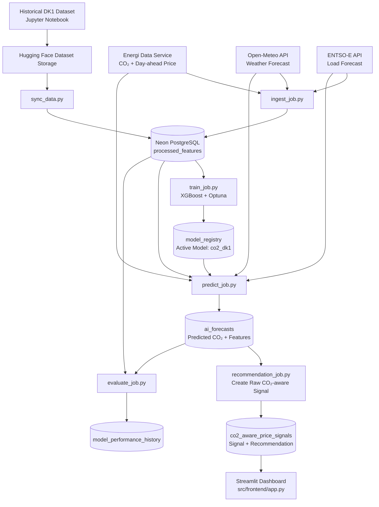
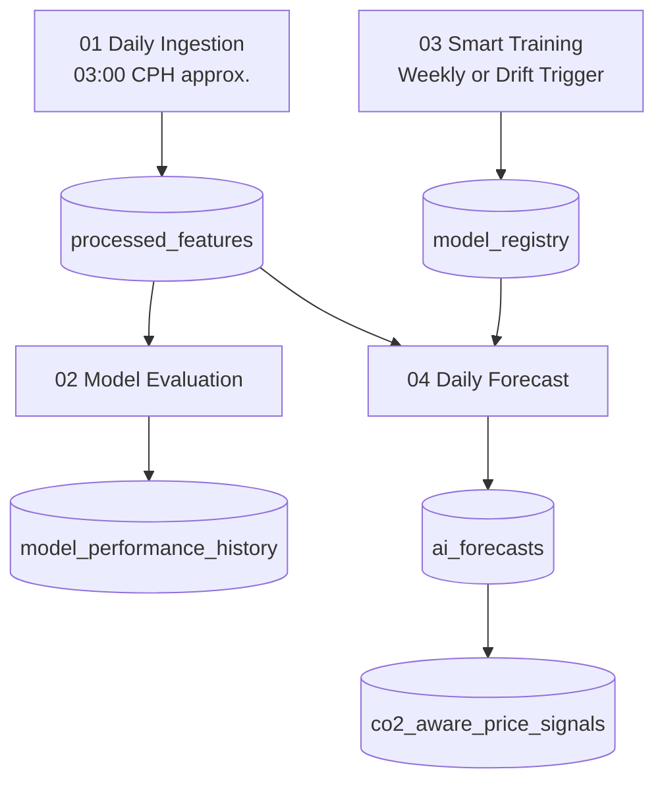

# Greenhour Guardian: DK1 CO₂-aware EV Charging Signal


Greenhour Guardian is an MLOps-based semester project that predicts CO₂ intensity for Denmark’s DK1 electricity price area and creates a CO₂-aware price signal for electric vehicle charging.

The project focuses on DK1 because Aalborg is located in the DK1 price area. The system combines DK1 day-ahead electricity price with predicted CO₂ intensity to identify more favourable and less favourable EV charging hours.

---

## Project Objective

The objective of this project is to develop a CO₂-aware price signal for EV charging by combining:

* DK1 day-ahead electricity price
* Predicted DK1 CO₂ intensity
* Weather forecast features
* Load forecast features
* Historical CO₂ lag, rolling, and difference features
* Time-based features

The final output is not an official electricity tariff. It is a normalized decision-support signal that helps compare charging hours using both electricity price and predicted emissions.

---

## Final Output

The final output is stored in the `co2_aware_price_signals` table.

It contains:

* DK1 electricity price
* Predicted CO₂ intensity
* Normalized price
* Normalized CO₂
* Raw CO₂-aware price signal
* BEST / CAUTION / AVOID recommendation label

The final signal is:

```python
raw_co2_aware_signal = 0.5 * normalized_price + 0.5 * normalized_co2
```

A lower signal means a more favourable charging hour.
A higher signal means a less favourable charging hour.

---

## Why Price and CO₂ Are Normalized

Price and CO₂ have different units and scales:

| Variable              | Unit     |
| --------------------- | -------- |
| `spot_price_dkk_kwh`  | DKK/kWh  |
| `predicted_co2_g_kwh` | gCO₂/kWh |

If they were combined directly, the larger numerical scale could dominate the result. Therefore, both values are converted to a 0–1 scale using min-max normalization.

```python
normalized_price = (price - min(price)) / (max(price) - min(price))

normalized_co2 = (predicted_co2 - min(predicted_co2)) / (max(predicted_co2) - min(predicted_co2))
```

A normalized value of `0` does not mean the price or CO₂ is zero. It means it is the lowest value within the selected 24-hour target day.

---

## Recommendation Logic

The recommendation is based on the `raw_co2_aware_signal`.

For each target day:

| Signal group | Label   | Meaning                         |
| ------------ | ------- | ------------------------------- |
| Lowest 25%   | BEST    | More favourable charging period |
| Middle 50%   | CAUTION | Moderate or mixed condition     |
| Highest 25%  | AVOID   | Less favourable charging period |

This makes the recommendation relative to the daily forecast window.

---

## Version 2 Summary

Version 2 is a cleaner DK1-only pipeline.

Main changes:

* Project scope changed to DK1 only
* Removed smoothing logic
* Removed `smoothed_co2_aware_signal`
* Removed `smoothing_window`
* Final signal is now `raw_co2_aware_signal`
* Removed wind and solar production forecast features because full next-day values were not consistently available
* Prediction output is stored only in `ai_forecasts`
* Final signal and recommendation are stored in `co2_aware_price_signals`
* Streamlit dashboard reads from `co2_aware_price_signals`
* Dashboard compares price, predicted CO₂, and CO₂-aware signal

---

## Removed Features

The following features were removed from the final model and prediction pipeline:

```text
forecast_wind_generation_mw
forecast_solar_generation_mw
forecast_wind_generation_gw
forecast_solar_generation_gw
```

Reason:

These future production forecast values were not consistently available for the full next-day prediction horizon at the time the prediction job was executed.

The model still uses weather-based renewable-related features:

```text
wind_speed
solar_radiation
temperature
```

---

## Technology Stack

* Python
* Pandas
* NumPy
* SQLAlchemy
* Neon PostgreSQL
* Hugging Face dataset storage
* Energi Data Service API
* Open-Meteo API
* ENTSO-E API
* XGBoost
* Optuna
* Scikit-learn
* Streamlit
* Plotly
* Docker
* GitHub Actions

---

## System Architecture



---

## Repository Structure

```text
.
├── notebooks/
│   └── 01_eda.ipynb
├── src/
│   ├── database/
│   │   └── connection.py
│   ├── frontend/
│   │   └── app.py
│   ├── pipeline/
│   │   ├── sync_data.py
│   │   ├── ingest_job.py
│   │   ├── train_job.py
│   │   ├── predict_job.py
│   │   ├── recommendation_job.py
│   │   └── evaluate_job.py
│   └── utils/
│       └── logger.py
├── .github/
│   └── workflows/
│       ├── daily_ingest.yml
│       ├── daily_prediction.yml
│       └── weekly_training.yml
├── Dockerfile
├── docker-compose.yml
├── requirements.txt
├── run_forecast.py
├── .dockerignore
├── .gitignore
└── README.md
```

---

## Main Pipeline Files

| File                    | Purpose                                                                                  |
| ----------------------- | ---------------------------------------------------------------------------------------- |
| `sync_data.py`          | Downloads historical CSV from Hugging Face and syncs it to Neon                          |
| `ingest_job.py`         | Fetches recent actual and forecast data and updates `processed_features`                 |
| `train_job.py`          | Trains DK1 XGBoost model and stores it in `model_registry`                               |
| `predict_job.py`        | Predicts DK1 CO₂ and stores output in `ai_forecasts`                                     |
| `recommendation_job.py` | Creates raw CO₂-aware signal and labels, then stores output in `co2_aware_price_signals` |
| `evaluate_job.py`       | Compares predicted CO₂ with actual CO₂ and stores metrics                                |
| `app.py`                | Streamlit dashboard                                                                      |
| `run_forecast.py`       | Runs prediction and recommendation together                                              |

---

## Model Features

The active DK1 model uses 26 features:

```text
spot_price_dkk_kwh
wind_speed
solar_radiation
temperature
forecast_load_gw

co2_lag_1h
co2_lag_2h
co2_lag_24h
co2_lag_168h

co2_rolling_3h
co2_rolling_6h
co2_rolling_24h

co2_diff_1h
co2_diff_24h

hour
day_of_week
month
day_of_year

hour_sin
hour_cos
month_sin
month_cos
day_of_year_sin
day_of_year_cos

is_weekend
is_holiday
```

---

## Unit Handling

The database keeps source units:

| Column                | Unit     |
| --------------------- | -------- |
| `spot_price_dkk_kwh`  | DKK/kWh  |
| `co2_emissions_g_kwh` | gCO₂/kWh |
| `forecast_load_mw`    | MW       |

For model input only:

```python
forecast_load_gw = forecast_load_mw / 1000
```

The database keeps `forecast_load_mw` in MW.

---

## Time Handling

The project uses Copenhagen time to define target Danish days, but stores timestamps in UTC.

Example during Danish summer time:

```text
00:00–23:00 Copenhagen time
=
22:00 previous day UTC → 21:00 target day UTC
```

This avoids timestamp mismatch between APIs, forecasting jobs, and database storage.

---

## Installation

Clone the repository:

```bash
git clone <your-repository-url>
cd gridwise-guardian
```

Create and activate a virtual environment:

```bash
python -m venv .venv
source .venv/bin/activate
```

Install dependencies:

```bash
pip install -r requirements.txt
```

---

## Environment Variables

Create a `.env` file in the project root:

```env
DATABASE_URL=your_neon_database_url
ENTSOE_TOKEN=your_entsoe_api_token
```

Do not commit `.env` to GitHub.

Required GitHub Secrets:

```text
DATABASE_URL
ENTSOE_TOKEN
```

---

## Running Locally

Run daily ingestion:

```bash
python -m src.pipeline.ingest_job
```

Train the model:

```bash
python -m src.pipeline.train_job
```

Run prediction:

```bash
python -m src.pipeline.predict_job
```

Run recommendation:

```bash
python -m src.pipeline.recommendation_job
```

Run prediction and recommendation together:

```bash
python run_forecast.py
```

Run evaluation:

```bash
python -m src.pipeline.evaluate_job
```

---

## Streamlit Dashboard

Run:

```bash
streamlit run src/frontend/app.py
```

The dashboard reads from:

```text
co2_aware_price_signals
```

It displays:

* Avoid hour
* Average price
* Average predicted CO₂
* Best hour
* Normalized comparison chart
* Original price and CO₂ chart
* Hourly recommendation table

---

## Docker

Build the Docker image:

```bash
docker build -t greenhour-guardian .
```

Run the container:

```bash
docker run -p 8501:8501 \
  -e DATABASE_URL="$DATABASE_URL" \
  -e ENTSOE_TOKEN="$ENTSOE_TOKEN" \
  greenhour-guardian
```

Then open:

```text
http://localhost:8501
```

---

## Docker Compose

Run with Docker Compose:

```bash
docker compose up --build
```

Then open:

```text
http://localhost:8501
```

---

## GitHub Actions Workflows

The project uses GitHub Actions for automation.

| Workflow              | Purpose                                  |
| --------------------- | ---------------------------------------- |
| `01 Daily Ingestion`  | Updates `processed_features`             |
| `02 Model Evaluation` | Evaluates yesterday’s prediction         |
| `03 Smart Training`   | Retrains weekly or when evaluation fails |
| `04 Daily Forecast`   | Runs prediction and recommendation       |



---

## Model Evaluation

The evaluation job compares:

```text
predicted CO₂ from ai_forecasts
vs
actual CO₂ from processed_features
```

Metrics saved to `model_performance_history`:

* MAE
* RMSE
* R²
* Accuracy percentage
* Mean actual CO₂
* Row count

If model accuracy drops below the configured threshold, the workflow can fail intentionally and trigger smart retraining.

---

## Academic Note

This project is inspired by carbon-aware EV charging and dynamic tariff literature, but it does not implement a full stochastic optimization tariff model.

Instead, it uses a transparent and interpretable normalized weighted signal:

```python
raw_co2_aware_signal = 0.5 * normalized_price + 0.5 * normalized_co2
```

This makes the method easy to explain, implement, and evaluate in an MLOps pipeline.

---

## Version

Current version:

```text
v2.0 — DK1 CO₂-aware price signal pipeline
```

---

## Author

**Praful Shrestha**
**Alina Shrestha**

MSc Business Data Science
Aalborg University
